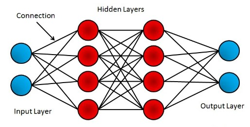
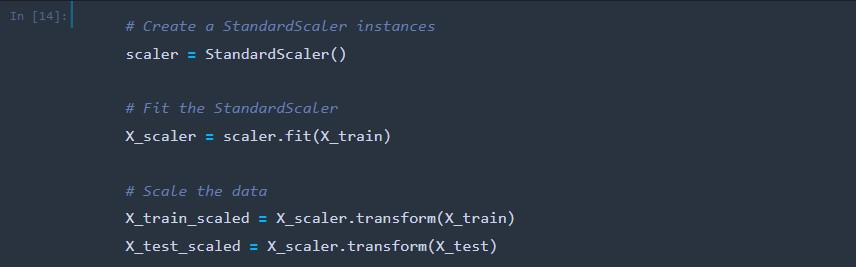

# Neural_Network_Charity_Analysis
 
## Creating a deep-learning neural network to analyze and classify the success of charitable donations with Python 

### Project Overview

Investors are always looking for ways to invest responsibly in organizations that align with their values. In the scenario used for this analysis, the fictitious company, Alphabet Soup, needs to choose the organizations to provide funding to out of a data set listing 34,000 different companies. Deep-learning algorithms and neural networks were used to create a binary classifier that analyzed and classified the success of Alphabet Soup’s charitable donations based on previous successful fundings. 

Neural networks are computing systems designed after the biological neural networks inside mammal brains. They are a subcategory of machine learning that uses deep-learning algorithms to operate. Neural networks are comprised of node layers, containing an input layer, hidden layers and an output later. Each node connects to another node and has an associated weight and threshold. When the output of a node exceeds the given threshold, the node is activated is passed to the next layer in the network. These networks rely on training data to learn and improve accuracy over time. When the algorithms are modified for accuracy, neural networks cluster and classify data at a high velocity. 

### Resources

#### Data Sets

* Charity_data.csv

#### Software

* Python 3.7.13 (Dependencies: Pandas 1.3.5, SciKit-Learn 1.0, Tensorflow 2.10.0)
* Anaconda 2022.10
* Jupyter Notebook 6.4.12

### Results

The data was first preprocessed using Pandas in the text editor, Jupyter Notebook. Columns that did not contain valuable information were dropped from the data set. 

Columns with more than ten unique values had rare categorical variables were then binned into a new column labelled “other”. 

The list of categorical values was then generated and encoded using OneHotEncoder and added into a new data frame.

The preprocessed data was then split into feature and target arrays. The target variable in this model is the IS_SUCCESSFUL column. The feature variables are the APPLICATION_TYPE, AFFILIATION, CLASSIFICATION, USE_CASE, ORGANIZATION, INCOME_AMT, and ASK_AMT columns. 

The numerical variables were standardized using the StandardScaler function. 

The model was defined, and the number of input features and hidden nodes for each layer were entered. Rectified Linear Unit (ReLU) was used as the activation function for both the first and second hidden layers. ReLU is a linear function that outputs the input directly if it is positive or otherwise outputs zero values. It is the default activation function many varieties of neural networks because models that use it are often easier to train and achieve better performance. The sigmoid activation function was used as the output layer. The sigmoid function takes a real value as an input and outputs it in the range of 0 to 1.

While training the model, a callback saves the model's weights every 5 epochs. A new directory was created where the weights were saved as checkpoints in the repository folder.   

After the model training was completed, the loss and accuracy values were evaluated. The accuracy rate returned was 72.5%.

The model was then exported to an HDF5 file (Hierarchical Data Format version 5) and saved within the repository folder. 

An effort was made to optimize the model to 75% or higher. To do this, the number of neurons in the first hidden layer were increased from 8 to 12 and the neurons in the second hidden layer were increased from 5 to 6. The number of epochs were also increased from 50 to 100.   

In the end, the accuracy rate was only increased to 73.4%. 

### Conclusion

The optimization attempt to increase the model’s predictive accuracy to 75% or higher was unsuccessful in this analysis. Conducting a further examination using the Random Forest Classifier could possibly yield better results if attempted in the future. The Random Forest Classifier consists of a large number of decision trees operating as an ensemble. Each tree in the forest returns a class prediction and the class with the highest count becomes the model's prediction. Alternate activation  functions should be explored. It is also possible that the input data needs to be reevaluated in case there are outliers or other variables that could be skewing the model’s accuracy. 
